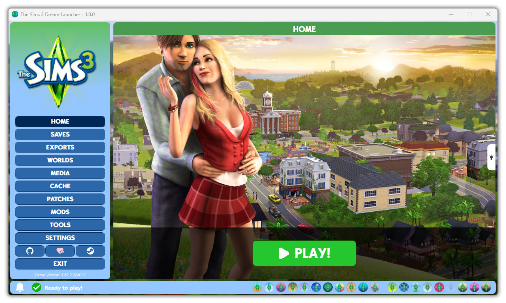

<p align="center" style="font-size: 2px;">
    
    <br>
    Clone this repository and then copy the "Dream-Launcher-Compiled" folder to your computer. Read all the instructions below and then just enjoy!
</p>

# About this Software

This "The Sims 3 Dream Launcher" is a Launcher for The Sims 3 created by Marcos Tomaz, a fan of The Sims. This is a Launcher developed to completely replace the game's original Launcher, developed by EA, in addition to being the "Dream Launcher" for every player who loves The Sims 3, just like me.

Although The Sims 3 is an incredible game, playing it today requires fixing a lot of things here and there, solve compatibility issues or bugs and other things. For example, there is a bug where the game resets all your settings if you update your video card drivers. For those using an Intel 12th CPU or higher, the game won't even open. If you are a gamer who likes to play with mods to deepen the gameplay or change things in the game, then everything becomes 5 times more complicated.

Dream Launcher was born with the aim of making the entire process of leaving your The Sims 3 in the most perfect state possible! Dream Launcher takes care of and manages your installation of The Sims 3 automatically, installing, updating and maintaining bug fixes, patches, graphical improvements and optimization, as well as giving you full control over every aspect of your game. See below some of the main features of Dream Launcher...

- Fully supports EN-US and PT-BR languages.
- Automatically installs and maintains patches for fixes and enhancements.
- Fixes game compatibility issue with Intel 12th+ CPUs.
- Allows you to view your Saves.
- Allows you to clean your Save files to deflate them.
- Allows you to make automatic backups of your Saves.
- It has saved Sims management.
- Allows you to clear the game's cache easily.
- Allows you to manage and install optional improvement patches and corrections.
- It has an advanced and easy to use, built-in mod manager.
- Allows you to install and uninstall mods ("sims3pack" and "package") easily.
- It has a library of recommended mods that can be installed or uninstalled in a few clicks.
- It has an arsenal of popular tools for The Sims 3 players like "S3PE", "S3OC","Dashboard", "PackageViewer" and "Sims3MultiExtracter".
- Change your game settings through the Launcher.
- Change the game language easily.

And there are several other functions. Keep reading to find out how to install it!

# To use this Software

I recommend uninstalling The Sims 3 and deleting the game folder in Documents on your computer, to make a clean and conflict-free installation. Keep in mind that this will erase your Saves.

To start, download this repository by cloning the "Dream-Launcher-Compiled" folder to your computer. After that, copy ALL the contents inside the folder. Go to your The Sims 3 installation directory and access the "Game/Bin" folder and paste all the copied content into this folder.

Now, go to Steam, and open The Sims 3 page in your library. Now, go to Steam, and open The Sims 3 page in your library. Click the gear icon and then click "Properties". In the "General" tab, paste the following content into the launch options. Of course, editing where necessary.

```
"<install-dir>\Game\Bin\TS3 Dream Launcher.exe" %command%
```

That is all! If you did everything correctly, now, when you click play The Sims 3 on Steam, the Dream Launcher will open, instead of the standard EA Launcher. Just enjoy! :)

# Prerequisites to use this Software

You need to fulfill some requirements to be able to use this Software...

- The computer may need to have <a href="https://download.visualstudio.microsoft.com/download/pr/81531ad6-afa9-4b61-9d05-6a76dce81123/2885d26c1a58f37176fd7859f8cc80f1/dotnet-sdk-6.0.417-win-x64.exe" target="_blank">.Net 6.0</a> installed in order to run the Software.
- The computer must be 64-bit.
- Your The Sims 3 must be of Steam and version "1.67.2.024037".
- Your computer's operating system must be Windows 10 or newer.
- Not compatible with Launcher created by <a href="https://github.com/LazyDuchess" target="_blank">Lazy Duchess</a>.

# Learn everything about this Launcher and The Sims 3!

Would you like to learn everything about this Launcher and The Sims 3, from the basics to how to modify your game, edit furniture, install mods, edit mods, optimization tips, best practices and many other things?

Access <a href="https://steamcommunity.com/sharedfiles/filedetails/?id=3118587838" target="_blank">this Steam mega-guide</a> to learn all this and more! Unfortunately, the guide is currently only available in Portuguese (PT-BR), but you can use Google Translate to view it in your language!

# How to edit this Software

The source project of this Software is here in this repository as well. You can simply open the "Dream-Launcher-Source" folder with your Visual Studio IDE and edit the Software.

# Special Thanks

I would like to thank the following people or entities for providing components that helped this Launcher get off the ground!

- <a href="https://github.com/LazyDuchess" target="_blank">Lazy Duchess</a> - By Intel Alder Lake Patcher, Intel Fix and its amazing mods!
- <a href="https://github.com/secana" target="_blank">Stefan Hausotte</a> - By the <a href="https://github.com/secana/PeNet" target="_blank">PeNET</a> library that allows patching of executables.
- <a href="https://sourceforge.net/u/pljones/profile/" target="_blank">Peter L Jones</a> - By the <a href="https://sourceforge.net/projects/s3pi/files/" target="_blank">S3PI</a> library that allows to edit game files.

# Support projects like this

If you liked the Dream Launcher and found it useful for your, please consider making a donation (if possible). This would make it even more possible for me to create and continue to maintain projects like this, but if you cannot make a donation, it is still a pleasure for you to use it! Thanks! 😀

<br>

<p align="center">
    <a href="https://www.paypal.com/donate/?hosted_button_id=MVDJY3AXLL8T2" target="_blank">
        
    </a>
</p>

<br>

<p align="center">
Created with ❤ by Marcos Tomaz
</p>